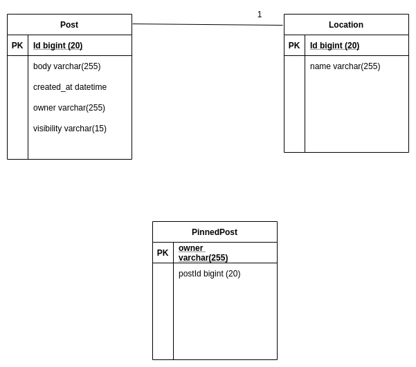

Authentication and authorization server: https://github.com/zeromsi/oauth-server
Travel-agency service: https://github.com/zeromsi/arifs-travel-agency
Frontend-service: https://github.com/zeromsi/travel-agency-frontend

### Step 1:  create a database ``` oauth ```

### Step 2: Run the following queries

``` xml

CREATE TABLE `oauth_access_token` (
  `token_id` text,
  `token` blob,
  `authentication_id` varchar(255) DEFAULT NULL,
  `user_name` varchar(255) DEFAULT NULL,
  `client_id` varchar(255) DEFAULT NULL,
  `authentication` blob,
  `refresh_token` varchar(255) DEFAULT NULL
) ENGINE=InnoDB DEFAULT CHARSET=latin1;


INSERT INTO `oauth_access_token` (`token_id`, `token`, `authentication_id`, `user_name`, `client_id`, `authentication`, `refresh_token`) VALUES
('73cffa5b241454613299382992cf8630', 0xaced0005737200436f72672e737072696e676672616d65776f726b2e73656375726974792e6f61757468322e636f6d6d6f6e2e44656661756c744f4175746832416363657373546f6b656e0cb29e361b24face0200064c00156164646974696f6e616c496e666f726d6174696f6e74000f4c6a6176612f7574696c2f4d61703b4c000a65787069726174696f6e7400104c6a6176612f7574696c2f446174653b4c000c72656672657368546f6b656e74003f4c6f72672f737072696e676672616d65776f726b2f73656375726974792f6f61757468322f636f6d6d6f6e2f4f417574683252656672657368546f6b656e3b4c000573636f706574000f4c6a6176612f7574696c2f5365743b4c0009746f6b656e547970657400124c6a6176612f6c616e672f537472696e673b4c000576616c756571007e00057870737200176a6176612e7574696c2e4c696e6b6564486173684d617034c04e5c106cc0fb0200015a000b6163636573734f72646572787200116a6176612e7574696c2e486173684d61700507dac1c31660d103000246000a6c6f6164466163746f724900097468726573686f6c6478703f4000000000000c77080000001000000002740005656d61696c74000e6a6f686e40676d61696c2e636f6d7400036a746974002432303830396462302d393765652d346161302d613236612d34336435346535653536303878007372000e6a6176612e7574696c2e44617465686a81014b597419030000787077080000016985f624d7787372004c6f72672e737072696e676672616d65776f726b2e73656375726974792e6f61757468322e636f6d6d6f6e2e44656661756c744578706972696e674f417574683252656672657368546f6b656e2fdf47639dd0c9b70200014c000a65787069726174696f6e71007e0002787200446f72672e737072696e676672616d65776f726b2e73656375726974792e6f61757468322e636f6d6d6f6e2e44656661756c744f417574683252656672657368546f6b656e73e10e0a6354d45e0200014c000576616c756571007e0005787074031f65794a68624763694f694a53557a49314e694973496e523563434936496b705856434a392e65794a68645751694f6c736956564e46556c394454456c46546c5266556b565454315653513055694c434a56553056535830464554556c4f58314a4655303956556b4e46496c3073496e567a5a584a66626d46745a534936496e567a5a5849694c434a7a593239775a53493657794a796232786c5832466b62576c7549697769636d39735a56393163325679496c3073496d463061534936496a49774f4441355a4749774c546b335a5755744e4746684d4331684d6a5a684c54517a5a4455305a54566c4e5459774f434973496d5634634349364d5455314d6a637a4d7a4d354e4377695958563061473979615852705a584d694f6c73695932467558334a6c5957526664584e6c63694973496e4a766247566664584e6c63694a644c434a7164476b694f6949304e44637a5a44566d4f4330344e7a41304c5451354f5755744f4456684d6930304e544a6a4d3251794d445978597a55694c434a6c6257467062434936496d7076614735415a323168615777755932397449697769593278705a57353058326c6b496a6f6956564e46556c394454456c46546c526651564251496e302e626e33616d52626f496e644f6c7759303038645a3470707773387246682d706c54685a4453456a6e55616f41337657516c697944466354546e46784d71644c6176304e6f6e32593653327a577456445363416a5362697974755f4d7241686b47685531536d4b513638506b426f37704437635835383242445634474a7477494b38775555507a2d6641663368474b7a6a494d46564445336a4e4b6632367171797941686b55574958394b457557396b37724d454f5a414e57437a744f624568444c51764e6d74703435716a3651504a3074355448366162726a4f5441347a417668644c396a7644576f2d65565030485733366d335f524a51754b4870626d326179746f3878467049526841555a466f726c4965774a735f515f3950306746583355434843573952645352304356696557533873426652743050764d596f7032643937694f636c6546754748435656714c734e635138777371007e000e770800000169861f57b678737200256a6176612e7574696c2e436f6c6c656374696f6e7324556e6d6f6469666961626c65536574801d92d18f9b80550200007872002c6a6176612e7574696c2e436f6c6c656374696f6e7324556e6d6f6469666961626c65436f6c6c656374696f6e19420080cb5ef71e0200014c0001637400164c6a6176612f7574696c2f436f6c6c656374696f6e3b7870737200176a6176612e7574696c2e4c696e6b656448617368536574d86cd75a95dd2a1e020000787200116a6176612e7574696c2e48617368536574ba44859596b8b7340300007870770c000000043f4000000000000274000a726f6c655f61646d696e740009726f6c655f75736572787400066265617265727402e365794a68624763694f694a53557a49314e694973496e523563434936496b705856434a392e65794a68645751694f6c736956564e46556c394454456c46546c5266556b565454315653513055694c434a56553056535830464554556c4f58314a4655303956556b4e46496c3073496e567a5a584a66626d46745a534936496e567a5a5849694c434a7a593239775a53493657794a796232786c5832466b62576c7549697769636d39735a56393163325679496c3073496d5634634349364d5455314d6a637a4d4459354e4377695958563061473979615852705a584d694f6c73695932467558334a6c5957526664584e6c63694973496e4a766247566664584e6c63694a644c434a7164476b694f6949794d4467774f5752694d4330354e32566c4c5452685954417459544932595330304d3251314e4755315a5455324d4467694c434a6c6257467062434936496d7076614735415a323168615777755932397449697769593278705a57353058326c6b496a6f6956564e46556c394454456c46546c526651564251496e302e41543931563646716f74616e77656831314c614e6c353871365043634b44707a7668614b696a58307a5f63336341546c455f46432d363148747364323344656f4b3235416d696b754463636932476e533962313234785034564458315a703531344e6d6247494a3866555967687446717a30794b566630722d32435258326f4d645a37467352706a4d555966584a703270506b4b425255435764556d696f413230632d466e57694c594348393869353677705f4e6a506b325f4a775349757a4f5a724a364b65446969717041587171324d5a563461704251514a7a496a446a75426f536b6b36485f44456d4342517739372d6862444c79634236436a5445555a324e306643453966616b554b484455385375333833726a73675855755556335559554d3638685135776b55666f6361443931735a3269516339376a7938714348633258346575435a5930717164765639375179647441, '85aaf11ef7d3d303aefaf394d7e0606b', 'user', 'USER_CLIENT_APP', 0xaced0005737200416f72672e737072696e676672616d65776f726b2e73656375726974792e6f61757468322e70726f76696465722e4f417574683241757468656e7469636174696f6ebd400b02166252130200024c000d73746f7265645265717565737474003c4c6f72672f737072696e676672616d65776f726b2f73656375726974792f6f61757468322f70726f76696465722f4f4175746832526571756573743b4c00127573657241757468656e7469636174696f6e7400324c6f72672f737072696e676672616d65776f726b2f73656375726974792f636f72652f41757468656e7469636174696f6e3b787200476f72672e737072696e676672616d65776f726b2e73656375726974792e61757468656e7469636174696f6e2e416273747261637441757468656e7469636174696f6e546f6b656ed3aa287e6e47640e0200035a000d61757468656e746963617465644c000b617574686f7269746965737400164c6a6176612f7574696c2f436f6c6c656374696f6e3b4c000764657461696c737400124c6a6176612f6c616e672f4f626a6563743b787000737200266a6176612e7574696c2e436f6c6c656374696f6e7324556e6d6f6469666961626c654c697374fc0f2531b5ec8e100200014c00046c6973747400104c6a6176612f7574696c2f4c6973743b7872002c6a6176612e7574696c2e436f6c6c656374696f6e7324556e6d6f6469666961626c65436f6c6c656374696f6e19420080cb5ef71e0200014c00016371007e00047870737200136a6176612e7574696c2e41727261794c6973747881d21d99c7619d03000149000473697a65787000000002770400000002737200426f72672e737072696e676672616d65776f726b2e73656375726974792e636f72652e617574686f726974792e53696d706c654772616e746564417574686f7269747900000000000001f40200014c0004726f6c657400124c6a6176612f6c616e672f537472696e673b7870740009726f6c655f757365727371007e000d74000d63616e5f726561645f757365727871007e000c707372003a6f72672e737072696e676672616d65776f726b2e73656375726974792e6f61757468322e70726f76696465722e4f41757468325265717565737400000000000000010200075a0008617070726f7665644c000b617574686f72697469657371007e00044c000a657874656e73696f6e7374000f4c6a6176612f7574696c2f4d61703b4c000b726564697265637455726971007e000e4c00077265667265736874003b4c6f72672f737072696e676672616d65776f726b2f73656375726974792f6f61757468322f70726f76696465722f546f6b656e526571756573743b4c000b7265736f7572636549647374000f4c6a6176612f7574696c2f5365743b4c000d726573706f6e7365547970657371007e0016787200386f72672e737072696e676672616d65776f726b2e73656375726974792e6f61757468322e70726f76696465722e426173655265717565737436287a3ea37169bd0200034c0008636c69656e74496471007e000e4c001172657175657374506172616d657465727371007e00144c000573636f706571007e0016787074000f555345525f434c49454e545f415050737200256a6176612e7574696c2e436f6c6c656374696f6e7324556e6d6f6469666961626c654d6170f1a5a8fe74f507420200014c00016d71007e00147870737200116a6176612e7574696c2e486173684d61700507dac1c31660d103000246000a6c6f6164466163746f724900097468726573686f6c6478703f400000000000037708000000040000000274000a6772616e745f7479706574000870617373776f7264740008757365726e616d657400047573657278737200256a6176612e7574696c2e436f6c6c656374696f6e7324556e6d6f6469666961626c65536574801d92d18f9b80550200007871007e0009737200176a6176612e7574696c2e4c696e6b656448617368536574d86cd75a95dd2a1e020000787200116a6176612e7574696c2e48617368536574ba44859596b8b7340300007870770c000000103f4000000000000274000a726f6c655f61646d696e740009726f6c655f7573657278017371007e0025770c000000103f40000000000000787371007e001c3f40000000000000770800000010000000007870707371007e0025770c000000103f40000000000002740014555345525f434c49454e545f5245534f55524345740013555345525f41444d494e5f5245534f55524345787371007e0025770c000000103f40000000000000787372004f6f72672e737072696e676672616d65776f726b2e73656375726974792e61757468656e7469636174696f6e2e557365726e616d6550617373776f726441757468656e7469636174696f6e546f6b656e00000000000001f40200024c000b63726564656e7469616c7371007e00054c00097072696e636970616c71007e00057871007e0003017371007e00077371007e000b0000000277040000000271007e000f71007e00117871007e0032737200176a6176612e7574696c2e4c696e6b6564486173684d617034c04e5c106cc0fb0200015a000b6163636573734f726465727871007e001c3f400000000000067708000000080000000271007e001e71007e001f71007e002071007e002178007073720014636f6d2e6e6766732e656e746974792e5573657200000000000000010200085a00116163636f756e744e6f6e457870697265645a00106163636f756e744e6f6e4c6f636b65645a001563726564656e7469616c734e6f6e457870697265645a0007656e61626c65644c0005656d61696c71007e000e4c000870617373776f726471007e000e4c0005726f6c657371007e00084c0008757365726e616d6571007e000e78700000000174000e6a6f686e40676d61696c2e636f6d74003c24326124313024454f733856524f62313465375a6e796476584543412e344c6f4968504f6f46484b7656462f69425a2f6b65723137456f637a3456697372002f6f72672e68696265726e6174652e636f6c6c656374696f6e2e696e7465726e616c2e50657273697374656e744261676563fd3f2082000c0200014c000362616771007e00087872003e6f72672e68696265726e6174652e636f6c6c656374696f6e2e696e7465726e616c2e416273747261637450657273697374656e74436f6c6c656374696f6ee9d3dc4da9113ba502000a5a001b616c6c6f774c6f61644f7574736964655472616e73616374696f6e49000a63616368656453697a655a000564697274795a000b696e697469616c697a65645a000d697354656d7053657373696f6e4c00036b65797400164c6a6176612f696f2f53657269616c697a61626c653b4c00056f776e657271007e00054c0004726f6c6571007e000e4c001273657373696f6e466163746f72795575696471007e000e4c000e73746f726564536e617073686f7471007e003b787000ffffffff000100737200116a6176612e6c616e672e496e746567657212e2a0a4f781873802000149000576616c7565787200106a6176612e6c616e672e4e756d62657286ac951d0b94e08b02000078700000000271007e003674001a636f6d2e6e6766732e656e746974792e557365722e726f6c6573707371007e000b0000000177040000000173720014636f6d2e6e6766732e656e746974792e526f6c65000000000000000102000349000269644c00046e616d6571007e000e4c000b7065726d697373696f6e7371007e000878700000000271007e00107371007e003900ffffffff00010071007e003f71007e0043740020636f6d2e6e6766732e656e746974792e526f6c652e7065726d697373696f6e73707371007e000b000000017704000000017372001a636f6d2e6e6766732e656e746974792e5065726d697373696f6e000000000000000102000249000269644c00046e616d6571007e000e78700000000371007e0012787371007e000b0000000177040000000171007e004878787371007e000b0000000177040000000171007e00437874000475736572, '592f2d2c5e248f9a4c74e9f13ec0c300'),
('64c81fa7c76a3715f36bd5c8d14e858e', 0xaced0005737200436f72672e737072696e676672616d65776f726b2e73656375726974792e6f61757468322e636f6d6d6f6e2e44656661756c744f4175746832416363657373546f6b656e0cb29e361b24face0200064c00156164646974696f6e616c496e666f726d6174696f6e74000f4c6a6176612f7574696c2f4d61703b4c000a65787069726174696f6e7400104c6a6176612f7574696c2f446174653b4c000c72656672657368546f6b656e74003f4c6f72672f737072696e676672616d65776f726b2f73656375726974792f6f61757468322f636f6d6d6f6e2f4f417574683252656672657368546f6b656e3b4c000573636f706574000f4c6a6176612f7574696c2f5365743b4c0009746f6b656e547970657400124c6a6176612f6c616e672f537472696e673b4c000576616c756571007e00057870737200176a6176612e7574696c2e4c696e6b6564486173684d617034c04e5c106cc0fb0200015a000b6163636573734f72646572787200116a6176612e7574696c2e486173684d61700507dac1c31660d103000246000a6c6f6164466163746f724900097468726573686f6c6478703f4000000000000c77080000001000000002740005656d61696c74001177696c6c69616d40676d61696c2e636f6d7400036a746974002466666265633666612d386533352d343034652d613262342d31383666396565336165363078007372000e6a6176612e7574696c2e44617465686a81014b5974190300007870770800000169865ea4ce787372004c6f72672e737072696e676672616d65776f726b2e73656375726974792e6f61757468322e636f6d6d6f6e2e44656661756c744578706972696e674f417574683252656672657368546f6b656e2fdf47639dd0c9b70200014c000a65787069726174696f6e71007e0002787200446f72672e737072696e676672616d65776f726b2e73656375726974792e6f61757468322e636f6d6d6f6e2e44656661756c744f417574683252656672657368546f6b656e73e10e0a6354d45e0200014c000576616c756571007e0005787074036e65794a68624763694f694a53557a49314e694973496e523563434936496b705856434a392e65794a68645751694f6c736956564e46556c394454456c46546c5266556b565454315653513055694c434a56553056535830464554556c4f58314a4655303956556b4e46496c3073496e567a5a584a66626d46745a534936496d466b62576c754969776963324e76634755694f6c7369636d39735a5639685a47317062694973496e4a766247566664584e6c63694a644c434a6864476b694f694a6d5a6d4a6c597a5a6d595330345a544d314c5451774e47557459544a694e4330784f445a6d4f57566c4d32466c4e6a41694c434a6c654841694f6a45314e5449334e4441794e444d73496d463164476876636d6c306157567a496a7062496e4a766247566659575274615734694c434a6a595735666458426b5958526c5833567a5a5849694c434a6a59573566636d56685a46393163325679496977695932467558324e795a5746305a5639316332567949697769593246755832526c624756305a56393163325679496c3073496d703061534936496d45324d5759795a6a4a684c54497a4e574d744e44566d4e4331694e54646b4c5459345954637a4e4752694d6a497a59794973496d567459576c73496a6f6964326c7362476c686255426e625746706243356a623230694c434a6a62476c6c626e5266615751694f694a565530565358304e4d5355564f564639425546416966512e4961705034433031666b327267522d713163726c557041635578627150593443506f7a49307a31706e3074543659646365414d536b74704c41683970544b474c6c6773625650576d754d5f497464304e57666456437259524e5676716c524775336d3379455636635a3733304269516568316f4a73533645766e76337554545a4656505a524a526736316d4e613537594f513741784d65504c6758777174505252617761746d6f576e6a316c3253627457656956396f6e5f58764d346e755550356f314d746259614a7a5a336d76524c5a4a37756237366a476376766c6376455a6d69306c416e7852625f497939394e6f4658344e5162746770337234743748764b76357764444a784438695a7054667041794d6347654c376c3852674763345f7944734e6769484c7636346e76435f357942662d5148543636374e664b637476776f5864584d746c574234535868576179312d59517371007e000e7708000001698687d7ab78737200256a6176612e7574696c2e436f6c6c656374696f6e7324556e6d6f6469666961626c65536574801d92d18f9b80550200007872002c6a6176612e7574696c2e436f6c6c656374696f6e7324556e6d6f6469666961626c65436f6c6c656374696f6e19420080cb5ef71e0200014c0001637400164c6a6176612f7574696c2f436f6c6c656374696f6e3b7870737200176a6176612e7574696c2e4c696e6b656448617368536574d86cd75a95dd2a1e020000787200116a6176612e7574696c2e48617368536574ba44859596b8b7340300007870770c000000043f4000000000000274000a726f6c655f61646d696e740009726f6c655f757365727874000662656172657274033265794a68624763694f694a53557a49314e694973496e523563434936496b705856434a392e65794a68645751694f6c736956564e46556c394454456c46546c5266556b565454315653513055694c434a56553056535830464554556c4f58314a4655303956556b4e46496c3073496e567a5a584a66626d46745a534936496d466b62576c754969776963324e76634755694f6c7369636d39735a5639685a47317062694973496e4a766247566664584e6c63694a644c434a6c654841694f6a45314e5449334d7a63314e444d73496d463164476876636d6c306157567a496a7062496e4a766247566659575274615734694c434a6a595735666458426b5958526c5833567a5a5849694c434a6a59573566636d56685a46393163325679496977695932467558324e795a5746305a5639316332567949697769593246755832526c624756305a56393163325679496c3073496d703061534936496d5a6d596d566a4e6d5a684c54686c4d7a55744e4441305a5331684d6d49304c5445344e6d59355a57557a595755324d434973496d567459576c73496a6f6964326c7362476c686255426e625746706243356a623230694c434a6a62476c6c626e5266615751694f694a565530565358304e4d5355564f564639425546416966512e42714b65414665775152524e4d4d71365f4a66685045644132456d352d6c553367366d5174456656736747424e67592d3558693078466f576c78366d585641774238597a4a31354d6d6f39454a64722d42515935647477536d7157667343744c30486b3078624a6f38524863394e6e783135465a5a777366335163476773453274624c4157764f777a2d776744586878746c30376a50424171424b4667315631686462474b38747a6c377837744e38664f586e594839566c3574313454565f66665a735656713273664f4f7a795a4f4936524f734f4d655363763477777470487874465959667957377737345131394d4f7076746377545251624c47684a47387a5a45367a6656344a7430373659325776494450467961656d3866615471322d3836703566536d6767646d6c6e4c65674f5f356f4d4537644b464d444848773554324b584e646a2d59786157756d7a4837365f696e77, '7fec7d6e025fc738a15f2f47de488ca1', 'admin', 'USER_CLIENT_APP', 0xaced0005737200416f72672e737072696e676672616d65776f726b2e73656375726974792e6f61757468322e70726f76696465722e4f417574683241757468656e7469636174696f6ebd400b02166252130200024c000d73746f7265645265717565737474003c4c6f72672f737072696e676672616d65776f726b2f73656375726974792f6f61757468322f70726f76696465722f4f4175746832526571756573743b4c00127573657241757468656e7469636174696f6e7400324c6f72672f737072696e676672616d65776f726b2f73656375726974792f636f72652f41757468656e7469636174696f6e3b787200476f72672e737072696e676672616d65776f726b2e73656375726974792e61757468656e7469636174696f6e2e416273747261637441757468656e7469636174696f6e546f6b656ed3aa287e6e47640e0200035a000d61757468656e746963617465644c000b617574686f7269746965737400164c6a6176612f7574696c2f436f6c6c656374696f6e3b4c000764657461696c737400124c6a6176612f6c616e672f4f626a6563743b787000737200266a6176612e7574696c2e436f6c6c656374696f6e7324556e6d6f6469666961626c654c697374fc0f2531b5ec8e100200014c00046c6973747400104c6a6176612f7574696c2f4c6973743b7872002c6a6176612e7574696c2e436f6c6c656374696f6e7324556e6d6f6469666961626c65436f6c6c656374696f6e19420080cb5ef71e0200014c00016371007e00047870737200136a6176612e7574696c2e41727261794c6973747881d21d99c7619d03000149000473697a65787000000005770400000005737200426f72672e737072696e676672616d65776f726b2e73656375726974792e636f72652e617574686f726974792e53696d706c654772616e746564417574686f7269747900000000000001f40200014c0004726f6c657400124c6a6176612f6c616e672f537472696e673b787074000a726f6c655f61646d696e7371007e000d74000d63616e5f726561645f757365727371007e000d74000f63616e5f7570646174655f757365727371007e000d74000f63616e5f6372656174655f757365727371007e000d74000f63616e5f64656c6574655f757365727871007e000c707372003a6f72672e737072696e676672616d65776f726b2e73656375726974792e6f61757468322e70726f76696465722e4f41757468325265717565737400000000000000010200075a0008617070726f7665644c000b617574686f72697469657371007e00044c000a657874656e73696f6e7374000f4c6a6176612f7574696c2f4d61703b4c000b726564697265637455726971007e000e4c00077265667265736874003b4c6f72672f737072696e676672616d65776f726b2f73656375726974792f6f61757468322f70726f76696465722f546f6b656e526571756573743b4c000b7265736f7572636549647374000f4c6a6176612f7574696c2f5365743b4c000d726573706f6e7365547970657371007e001c787200386f72672e737072696e676672616d65776f726b2e73656375726974792e6f61757468322e70726f76696465722e426173655265717565737436287a3ea37169bd0200034c0008636c69656e74496471007e000e4c001172657175657374506172616d657465727371007e001a4c000573636f706571007e001c787074000f555345525f434c49454e545f415050737200256a6176612e7574696c2e436f6c6c656374696f6e7324556e6d6f6469666961626c654d6170f1a5a8fe74f507420200014c00016d71007e001a7870737200116a6176612e7574696c2e486173684d61700507dac1c31660d103000246000a6c6f6164466163746f724900097468726573686f6c6478703f400000000000037708000000040000000274000a6772616e745f7479706574000870617373776f7264740008757365726e616d6574000561646d696e78737200256a6176612e7574696c2e436f6c6c656374696f6e7324556e6d6f6469666961626c65536574801d92d18f9b80550200007871007e0009737200176a6176612e7574696c2e4c696e6b656448617368536574d86cd75a95dd2a1e020000787200116a6176612e7574696c2e48617368536574ba44859596b8b7340300007870770c000000103f4000000000000274000a726f6c655f61646d696e740009726f6c655f7573657278017371007e002b770c000000103f40000000000000787371007e00223f40000000000000770800000010000000007870707371007e002b770c000000103f40000000000002740014555345525f434c49454e545f5245534f55524345740013555345525f41444d494e5f5245534f55524345787371007e002b770c000000103f40000000000000787372004f6f72672e737072696e676672616d65776f726b2e73656375726974792e61757468656e7469636174696f6e2e557365726e616d6550617373776f726441757468656e7469636174696f6e546f6b656e00000000000001f40200024c000b63726564656e7469616c7371007e00054c00097072696e636970616c71007e00057871007e0003017371007e00077371007e000b0000000577040000000571007e000f71007e001171007e001371007e001571007e00177871007e0038737200176a6176612e7574696c2e4c696e6b6564486173684d617034c04e5c106cc0fb0200015a000b6163636573734f726465727871007e00223f400000000000067708000000080000000271007e002471007e002571007e002671007e002778007073720014636f6d2e6e6766732e656e746974792e5573657200000000000000010200085a00116163636f756e744e6f6e457870697265645a00106163636f756e744e6f6e4c6f636b65645a001563726564656e7469616c734e6f6e457870697265645a0007656e61626c65644c0005656d61696c71007e000e4c000870617373776f726471007e000e4c0005726f6c657371007e00084c0008757365726e616d6571007e000e78700000000174001177696c6c69616d40676d61696c2e636f6d74003c24326124313024454f733856524f62313465375a6e796476584543412e344c6f4968504f6f46484b7656462f69425a2f6b65723137456f637a3456697372002f6f72672e68696265726e6174652e636f6c6c656374696f6e2e696e7465726e616c2e50657273697374656e744261676563fd3f2082000c0200014c000362616771007e00087872003e6f72672e68696265726e6174652e636f6c6c656374696f6e2e696e7465726e616c2e416273747261637450657273697374656e74436f6c6c656374696f6ee9d3dc4da9113ba502000a5a001b616c6c6f774c6f61644f7574736964655472616e73616374696f6e49000a63616368656453697a655a000564697274795a000b696e697469616c697a65645a000d697354656d7053657373696f6e4c00036b65797400164c6a6176612f696f2f53657269616c697a61626c653b4c00056f776e657271007e00054c0004726f6c6571007e000e4c001273657373696f6e466163746f72795575696471007e000e4c000e73746f726564536e617073686f7471007e0041787000ffffffff000100737200116a6176612e6c616e672e496e746567657212e2a0a4f781873802000149000576616c7565787200106a6176612e6c616e672e4e756d62657286ac951d0b94e08b02000078700000000171007e003c74001a636f6d2e6e6766732e656e746974792e557365722e726f6c6573707371007e000b0000000177040000000173720014636f6d2e6e6766732e656e746974792e526f6c65000000000000000102000349000269644c00046e616d6571007e000e4c000b7065726d697373696f6e7371007e000878700000000171007e00107371007e003f00ffffffff00010071007e004571007e0049740020636f6d2e6e6766732e656e746974792e526f6c652e7065726d697373696f6e73707371007e000b000000047704000000047372001a636f6d2e6e6766732e656e746974792e5065726d697373696f6e000000000000000102000249000269644c00046e616d6571007e000e78700000000171007e00167371007e004d0000000271007e00147371007e004d0000000371007e00127371007e004d0000000471007e0018787371007e000b0000000477040000000471007e004e71007e004f71007e005071007e005178787371007e000b0000000177040000000171007e00497874000561646d696e, '56ae750a5391420ed5821a780f627abd');


CREATE TABLE `oauth_client_details` (
  `client_id` varchar(256) NOT NULL,
  `resource_ids` varchar(256) DEFAULT NULL,
  `client_secret` varchar(256) DEFAULT NULL,
  `scope` varchar(256) DEFAULT NULL,
  `authorized_grant_types` varchar(256) DEFAULT NULL,
  `web_server_redirect_uri` varchar(256) DEFAULT NULL,
  `authorities` varchar(256) DEFAULT NULL,
  `access_token_validity` int(11) DEFAULT NULL,
  `refresh_token_validity` int(11) DEFAULT NULL,
  `additional_information` varchar(4096) DEFAULT NULL,
  `autoapprove` varchar(256) DEFAULT NULL
) ENGINE=InnoDB DEFAULT CHARSET=latin1;

INSERT INTO `oauth_client_details` (`client_id`, `resource_ids`, `client_secret`, `scope`, `authorized_grant_types`, `web_server_redirect_uri`, `authorities`, `access_token_validity`, `refresh_token_validity`, `additional_information`, `autoapprove`) VALUES
('USER_CLIENT_APP', 'USER_CLIENT_RESOURCE,USER_ADMIN_RESOURCE,travelagency', '{bcrypt}$2a$10$EOs8VROb14e7ZnydvXECA.4LoIhPOoFHKvVF/iBZ/ker17Eocz4Vi', 'role_admin,role_user', 'authorization_code,password,refresh_token,implicit', NULL, NULL, 900, 3600, '{}', NULL);

CREATE TABLE `oauth_client_token` (
  `token_id` text,
  `token` blob,
  `authentication_id` varchar(255) DEFAULT NULL,
  `user_name` varchar(255) DEFAULT NULL,
  `client_id` varchar(255) DEFAULT NULL
) ENGINE=InnoDB DEFAULT CHARSET=latin1;

CREATE TABLE `oauth_code` (
  `code` varchar(255) DEFAULT NULL,
  `authentication` blob
) ENGINE=InnoDB DEFAULT CHARSET=latin1;


CREATE TABLE `oauth_refresh_token` (
  `token_id` text,
  `token` blob,
  `authentication` blob
) ENGINE=InnoDB DEFAULT CHARSET=latin1;


CREATE TABLE `permission` (
  `id` int(11) NOT NULL,
  `name` varchar(255) DEFAULT NULL
) ENGINE=MyISAM DEFAULT CHARSET=latin1;


INSERT INTO `permission` (`id`, `name`) VALUES
(1, 'can_create_user'),
(2, 'can_update_user'),
(3, 'can_read_user'),
(4, 'can_delete_user');

CREATE TABLE `permission_role` (
  `role_id` int(11) NOT NULL,
  `permission_id` int(11) NOT NULL
) ENGINE=MyISAM DEFAULT CHARSET=latin1;

INSERT INTO `permission_role` (`role_id`, `permission_id`) VALUES
(1, 1),
(1, 2),
(1, 3),
(1, 4),
(2, 3);

CREATE TABLE `role` (
  `id` int(11) NOT NULL,
  `name` varchar(255) DEFAULT NULL
) ENGINE=MyISAM DEFAULT CHARSET=latin1;

INSERT INTO `role` (`id`, `name`) VALUES
(1, 'role_super_admin'),
(2, 'role_user');

CREATE TABLE `role_user` (
  `user_id` int(11) NOT NULL,
  `role_id` int(11) NOT NULL
) ENGINE=MyISAM DEFAULT CHARSET=latin1;

INSERT INTO `role_user` (`user_id`, `role_id`) VALUES
(1, 1),
(2, 2);

CREATE TABLE `user` (
  `id` int(11) NOT NULL,
  `account_expired` bit(1) DEFAULT NULL,
  `account_locked` bit(1) DEFAULT NULL,
  `credentials_expired` bit(1) DEFAULT NULL,
  `email` varchar(255) DEFAULT NULL,
  `enabled` bit(1) NOT NULL,
  `password` varchar(255) DEFAULT NULL,
  `username` varchar(255) DEFAULT NULL
) ENGINE=MyISAM DEFAULT CHARSET=latin1;


INSERT INTO `user` (`id`, `account_expired`, `account_locked`, `credentials_expired`, `email`, `enabled`, `password`, `username`, `name`) VALUES
(1, b'0', b'0', b'0', 'william@gmail.com', b'1', '{bcrypt}$2a$10$EOs8VROb14e7ZnydvXECA.4LoIhPOoFHKvVF/iBZ/ker17Eocz4Vi', 'admin', NULL),
(2, b'0', b'0', b'0', 'john@gmail.com', b'1', '{bcrypt}$2a$10$EOs8VROb14e7ZnydvXECA.4LoIhPOoFHKvVF/iBZ/ker17Eocz4Vi', 'user', NULL),
(3, b'0', b'0', b'0', 'www.zeromsi2@gmail.com', b'1', '{bcrypt}$2a$10$Js.T0mRh3HjQ5rWvc75tsOX06dnsjeQYI20NstBhXnvmE7KKPHPV2', 'zeromsi', 'Shahidul'),
(4, b'0', b'0', b'0', 'www.zeromsi3@gmail.com', b'1', '{bcrypt}$2a$10$8sHWOaNwrMDVBeMyFnB2Iu02MKa1Y9WiM2eusPt8U/2VTREFaquvG', 'zeromsi2', 'Shahidul'),
(5, b'0', b'0', b'0', 'www.zeromsi4@gmail.com', b'1', '{bcrypt}$2a$10$YjbJV6LKVwOPTjbh6oT/xOVZC11tq7ubIEPzrX6dBdlRuMrQTXQ96', 'zeromsi5', 'Shahidul'),
(6, b'0', b'0', b'0', '', b'1', '{bcrypt}$2a$10$yvFRRORMD7XXcBjqzgJtn.1s17zJR93qTBMIsOa5DC7tlx5LpSqni', '', ''),
(7, b'0', b'0', b'0', 'www.zeromsi5@gmail.com', b'1', '{bcrypt}$2a$10$m338A4q3LlIq0tleJX4VPe0H0LU5nzLLudTshRzMOVJccsi1ZySB2', 'zero', 'zero'),
(8, b'0', b'0', b'0', 'www.zeromsi8@gmail.com', b'1', '{bcrypt}$2a$10$dPrIgcxmxrsaDecjdIQSz.hINJw2WYsb6uRyGIvHi.RK12WFE5/HC', 'msi', 'msi'),
(9, b'0', b'0', b'0', 'abc', b'1', '{bcrypt}$2a$10$nOmM6ZLk19t7v0gOTDEd7O22/J.k9k9poBQknyJc8tWvSVtcsUOCe', 'abc', 'abc');

ALTER TABLE `oauth_client_details`
  ADD PRIMARY KEY (`client_id`);

--
-- Indexes for table `permission`
--
ALTER TABLE `permission`
  ADD PRIMARY KEY (`id`);

--
-- Indexes for table `permission_role`
--
ALTER TABLE `permission_role`
  ADD KEY `FK3tuvkbyi6wcytyg21hvpd6txw` (`permission_id`),
  ADD KEY `FK50sfdcvbvdaclpn7wp4uop4ml` (`role_id`);

--
-- Indexes for table `role`
--
ALTER TABLE `role`
  ADD PRIMARY KEY (`id`);

--
-- Indexes for table `role_user`
--
ALTER TABLE `role_user`
  ADD KEY `FKiqpmjd2qb4rdkej916ymonic6` (`role_id`),
  ADD KEY `FK4320p8bgvumlxjkohtbj214qi` (`user_id`);

--
-- Indexes for table `user`
--
ALTER TABLE `user`
  ADD PRIMARY KEY (`id`);

--
-- AUTO_INCREMENT for dumped tables
--

--
-- AUTO_INCREMENT for table `permission`
--
ALTER TABLE `permission`
  MODIFY `id` int(11) NOT NULL AUTO_INCREMENT, AUTO_INCREMENT=5;

--
-- AUTO_INCREMENT for table `role`
--
ALTER TABLE `role`
  MODIFY `id` int(11) NOT NULL AUTO_INCREMENT, AUTO_INCREMENT=3;

--
-- AUTO_INCREMENT for table `user`
--
ALTER TABLE `user`
  MODIFY `id` int(11) NOT NULL AUTO_INCREMENT, AUTO_INCREMENT=3;

```

### Step 3: create database ``` travelagency ```

### Step 4: Run ``` oauth-server ```
### Step 5: Run ``` travel-agency service```
### Step 6 : Run ``` frontend project ````


### ERD diagram of ``` travel-agency-service ```


